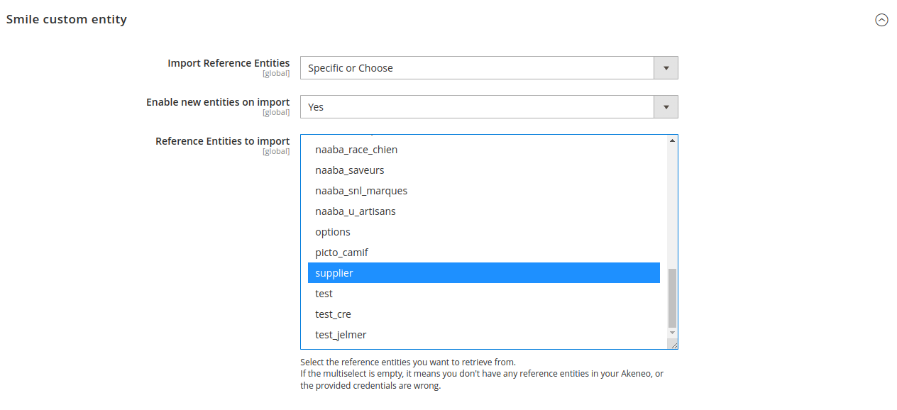
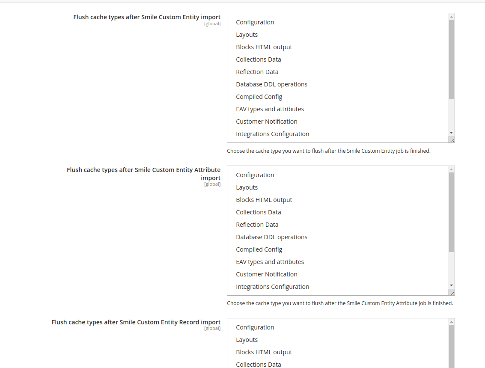

# Configuration

Stores => Settings => Configuration => Catalog => Akeneo Connector

Firs You need to configure the [Akeneo connector with PIM API information](https://help.akeneo.com/magento2-connector/articles/02-configure-PIM-API.html#how-to-configure-the-connector-with-my-pim-api-information)

## Custom entity type section
Available configuration:

**Import Reference Entities**
* **All** - import all existing reference entities.
* **Specific or Choose** - import only selected entities.

Selected configuration affects the import of the entity type, attributes, options and records.

**Enable new entities on import**

Select status for imported entity records.

**Reference Entities to import**

Depends on **Import Reference Entities**. Select reference entities You want to import. If the multiselect is empty, it means you don't have any reference entities in your Akeneo, or the provided credentials are wrong.

## Cache section
Flush selected cache types after import

